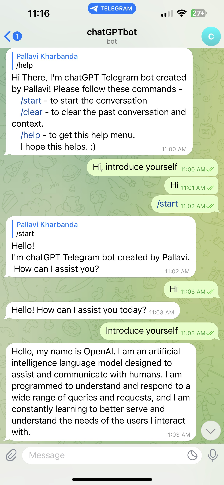

# chatGPT-Telegram-bot

#conda init command gives base environment

#bash init_setup.sh creates environment and installs requirements.txt  

#environment can be activated using command conda activate ./env

#Openai key and telegram token are in .env file
